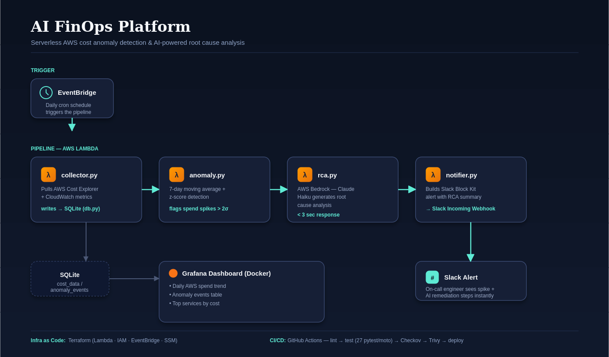

# AI FinOps Platform

> AI-powered AWS cost anomaly detection and automated remediation system, built with production-grade DevOps practices.


## What it does

Automatically detects unusual AWS spending patterns using statistical anomaly detection, generates AI-powered root cause analysis using AWS Bedrock (Claude), sends actionable Slack alerts, and visualizes cost trends in Grafana — all running serverlessly on AWS Lambda.

On-call engineers get context on a cost spike within minutes of it happening, instead of finding out when the monthly bill arrives.

## Architecture



```
EventBridge (daily cron)
        │
        ▼
Lambda: collector.py  →  pulls Cost Explorer + CloudWatch data  →  SQLite
        │
        ▼
Lambda: anomaly.py    →  7-day moving average + z-score detection
        │
        ▼
Lambda: rca.py         →  AWS Bedrock (Claude Haiku) generates root cause analysis
        │
        ▼
Lambda: notifier.py    →  Slack Block Kit alert with RCA summary
        │
        ▼
Grafana (Docker)       →  cost trend, anomaly count, top-services dashboards
```

## Tech Stack

| Layer | Tool |
|---|---|
| Infrastructure | Terraform |
| Compute | AWS Lambda (Python 3.11) |
| Scheduling | AWS EventBridge |
| Data | AWS Cost Explorer + CloudWatch |
| AI | AWS Bedrock (Claude Haiku) |
| Alerts | Slack Incoming Webhooks |
| Dashboards | Grafana + SQLite datasource |
| CI/CD | GitHub Actions (lint, test, security scan, deploy) |
| Security | Checkov (Terraform) + Trivy (Docker) |
| Secrets | AWS SSM Parameter Store |
| Storage | SQLite |
| Testing | pytest + moto (27 tests) |

## Project Structure

```
ai-finops-platform/
├── lambda/
│   ├── src/
│   │   ├── collector.py   # Cost Explorer ingestion
│   │   ├── anomaly.py     # Moving average + z-score detection
│   │   ├── rca.py         # Bedrock AI root cause analysis
│   │   ├── notifier.py    # Slack alert builder
│   │   └── db.py          # SQLite data layer
│   └── tests/              # 27 unit tests with moto mocks
├── terraform/               # Lambda, IAM, EventBridge, SSM
├── docker/                  # Grafana Docker Compose stack
├── docs/                    # Setup guide + architecture diagram
└── .github/workflows/       # 6-job CI/CD pipeline
```

## Key Engineering Decisions

**Why Terraform over CloudFormation?**
Terraform is cloud-agnostic and widely adopted across companies, and reusable across future projects.

**Why Lambda over EC2?**
Serverless fits the daily scheduling pattern perfectly — zero idle cost, only runs for ~2 seconds a day.

**Why SQLite over RDS/DynamoDB?**
Keeps the project cost near zero while demonstrating the same data-modeling skills. Explicitly documented as a v1 trade-off.

**Why a simple moving average over ML?**
Engineering judgment: ship a baseline that's explainable, cheap, and fast. ML is documented as a v2 enhancement.

**Why Bedrock over OpenAI?**
Keeps the architecture AWS-native with IAM-based access control — a better fit for AWS-focused roles.

## Results

- Detects cost spikes with z-score > 2.0 standard deviations above the 7-day baseline
- Generates AI root cause analysis and remediation steps in under 3 seconds
- Sends formatted Slack alerts with anomaly context and AI recommendations
- 27 unit tests passing with moto AWS mocks — zero real AWS calls in tests
- Full CI/CD pipeline: lint → test → security scan → terraform validate → deploy

## Business Impact

This system addresses a real problem: AWS cost overruns that go undetected for days. By combining statistical anomaly detection with AI-powered root cause analysis and instant Slack alerts, on-call engineers get actionable information within minutes of a cost spike — not after the monthly bill arrives.

## Setup

See [docs/setup.md](docs/setup.md) for full setup instructions.

**Quick start:**
```bash
git clone https://github.com/Akashpeter19/ai-finops-platform
cd ai-finops-platform/terraform
terraform init && terraform apply
```

## Project Status

- [x] Phase 0 — Repo, Terraform, IAM, Docker, CI skeleton
- [x] Phase 1 — Data collection (Cost Explorer + CloudWatch)
- [x] Phase 2 — Anomaly detection (moving average + z-score)
- [x] Phase 3 — AI root cause analysis (AWS Bedrock)
- [x] Phase 4 — Slack alerts + CI/CD auto-deploy pipeline
- [x] Phase 5 — Grafana dashboards (Docker + SQLite)
- [x] Phase 6 — Security scanning (Checkov + Trivy)
- [x] Phase 7 — Documentation + resume polish

## Author

**Akash Peter Prakash** — Aspiring AWS DevOps Engineer
[LinkedIn](https://linkedin.com/in/akashpeter19) · [GitHub](https://github.com/Akashpeter19) · [Portfolio](https://akashpeter.netlify.app)
